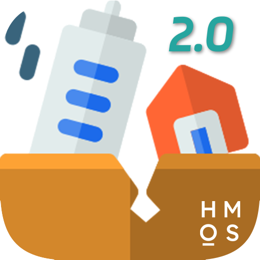

**简体中文** | [繁體中文](README-TW.md) | [English](README-EN.md)

<div align="center">


    
# CNQuake2
    
[](https://github.com/liujh5913/CNQuake2/)
[](https://space.bilibili.com/3493093166811354/dynamic)
[](https://github.com/liujh5913/CNQuake2/issues)
[](LICENSE) <br />
    
[提交问题](https://github.com/liujh5913/CNQuake2/issues/new)

</div>

CNQuake2 是一个基于现代 Web 技术构建的中国地震信息可视化 [`PWA`](https://developer.mozilla.org/zh-CN/docs/Web/Progressive_web_apps) 应用，提供实时地震预警、历史地震查询、地震波可视化等功能。

如本项目内容侵犯了您的权益，请通过 [Issue](https://github.com/liujh5913/CNQuake2/issues/new) 或邮件 liujh5913@petalmail.com 联系，我将会尽快处理。

## 🚀 运行须知

本应用需在 **HTTPS** 环境下运行，并正确配置 SSL 证书。受腾讯地图 CORS 跨域策略限制，请勿以 `file://` 协议直接打开，否则地图图标将回退为默认 Marker 样式。同时，PWA 安装及 Service Worker 通知推送功能，仅在安全上下文下可用。

## 💻 支持平台

| 操作系统 | 支持情况 | 环境要求 |
|---|---|---|
| Windows / macOS / Linux | ✅ 完整支持 | 现代浏览器（Chrome 90+、Firefox 88+、Edge 90+、Safari 14+） |
| iOS / Android | ✅ 完整支持 | 系统自带浏览器或现代移动浏览器 |
| 旧版浏览器 | ⚠️ 理论能跑，酌情提供支持 | 支持 ES6+ 的浏览器 |

**✅ 完整支持**：提供完整功能支持，包括 PWA 安装、实时预警推送等。

**⚠️ 理论能跑**：基本功能可用，但部分现代特性可能受限。

## 🎯 规划中的功能

- 支持自定义本地烈度触发阈值
- 多地震事件并发适配
- 重绘地震波渲染逻辑，替代官方 [`MultiCircle`](https://lbs.qq.com/webApi/javascriptGL/glDoc/glDocVector#13) 方案，使波形更贴合地球曲面
- 写一个现代化的设置UI界面，提供更直观的操作体验
- **以上功能欢迎社区贡献代码**

## ⚠️ 已知问题

- 腾讯地图绘制的圆形为标准几何圆，未做地球曲率贴合处理。在高纬度区域，地图上的地震波传播路径存在视觉畸变，仅供示意参考，实际预警请以右下角倒计时面板为准。
- 由于腾讯地图圆形对象不支持 `getCircleBounds()` 方法，`getWaveBounds()` 为自行实现，当地图缩放级别降低时，视角中心会向北偏移。
- 腾讯地图圆形存在最大半径上限，当 P 波传播距离超出该限制后，控制台将输出经纬度越界警告，波形动画将在最大半径处静止。

## 📊 数据源说明

~~Wolfx 防灾 API~~

自 25H1 后，本项目预警数据源调整为 **FAN Studio - API**（`https://api.fanstudio.tech/`）。选用该接口系基于国内网络环境下的实测表现，其在响应延迟与连接稳定性方面具备一定优势，能够更好地保障预警信息的时效性。

> [!WARNING]
> 任何第三方数据服务均可能存在变动。本项目的数据源选择始终遵循技术适配原则，以实际运行效果为唯一衡量标准。如该接口后续出现服务质量波动或可用性变化，项目将视情评估并调整数据源配置，以确保服务的持续可靠。

## 📜 免责声明

本软件仅供参考，请勿作为唯一决策依据。因依赖本软件所产生的任何直接或间接损失，包括但不限于人身、财产、数据损失，作者概不承担法律责任。

## 🔒 许可证

本项目基于 [GPL-v3](LICENSE) 协议开源。

```
    China Quake 2 (CNQuake2)
    Copyright (C) 2024 - 2026  HomoOS

    This program is free software: you can redistribute it and/or modify
    it under the terms of the GNU General Public License as published by
    the Free Software Foundation, either version 3 of the License, or
    (at your option) any later version.

    This program is distributed in the hope that it will be useful,
    but WITHOUT ANY WARRANTY; without even the implied warranty of
    MERCHANTABILITY or FITNESS FOR A PARTICULAR PURPOSE.  See the
    GNU General Public License for more details.

    You should have received a copy of the GNU General Public License
    along with this program.  If not, see <https://www.gnu.org/licenses/>.
```

## 🌟 统计数据


[](https://www.star-history.com/#liujh5913/CNQuake2&Date)